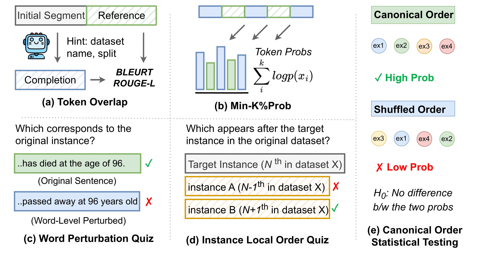

# Towards Data Contamination Detection for Modern Large Language Models: Limitations, Inconsistencies, and Oracle Challenges



This repository contains the dataset and code of the paper:
> **Towards Data Contamination Detection for Modern Large Language Models: Limitations, Inconsistencies, and Oracle Challenges**  
> <br>**COLING 2025** <br>


## Datasets
Our evaluation data are released in the [data](https://github.com/vsamuel2003/data-contamination/tree/main/datasets) folder. These data files are processed versions of data that is found online. 

## Code
All of the code that is part of running our evaluations is provided in [data](https://github.com/vsamuel2003/data-contamination/tree/main/code). Both the WPQ and Local Order Quiz is run using [this](https://github.com/vsamuel2003/data-contamination/blob/main/code/main.py) while the Token Overlap method is run [here](https://github.com/vsamuel2003/data-contamination/blob/main/code/Token_Overlap/run.py) and the Canonical Order is ran [here](https://github.com/vsamuel2003/data-contamination/blob/main/code/Canonical_order.py) and the Min-K% is ran [here](https://github.com/vsamuel2003/data-contamination/blob/main/code/mink.py).


Here we provide an example of setting up the environment

## Setup
```bash
# Environment setup
conda create -n contamination python=3.9 -y
conda activate contamination

# install dependency
pip install -r requirements.txt
```

## Bugs or Questions

If you have any questions related to the dataset or the paper, feel free to email Vinay Samuel(vsamuel@umd.edu). If you encounter any problems when using the code, or want to report a bug, you can open an issue. Please try to specify the problem with details so we can help you better and quicker!

## Citation
If you find this repository helpful, please consider citing our paper: 
```bibtex
@inproceedings{samuel-etal-2025-towards,
    title = "Towards Data Contamination Detection for Modern Large Language Models: Limitations, Inconsistencies, and Oracle Challenges",
    author = "Samuel, Vinay  and
      Zhou, Yue  and
      Zou, Henry Peng",
    editor = "Rambow, Owen  and
      Wanner, Leo  and
      Apidianaki, Marianna  and
      Al-Khalifa, Hend  and
      Eugenio, Barbara Di  and
      Schockaert, Steven",
    booktitle = "Proceedings of the 31st International Conference on Computational Linguistics",
    month = jan,
    year = "2025",
    address = "Abu Dhabi, UAE",
    publisher = "Association for Computational Linguistics",
    url = "https://aclanthology.org/2025.coling-main.338/"
}
```
