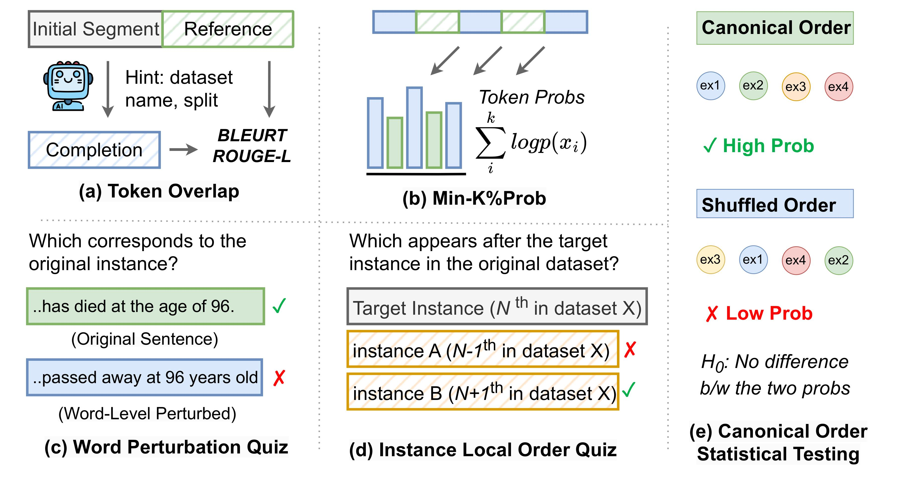

# Towards Data Contamination Detection for Modern Large Language Models: Limitations, Inconsistencies, and Oracle Challenges



This repository contains the dataset and code of the paper:
> **Towards Data Contamination Detection for Modern Large Language Models: Limitations, Inconsistencies, and Oracle Challenges** 
> Under Review <br>


## Datasets
Our evaluation data are released in the [data](https://github.com/vsamuel2003/data-contamination/tree/main/datasets) folder. These data files are processed versions of data that is found online. 

## Code
All of the code that is part of running our evaluations is provided in [data](https://github.com/vsamuel2003/data-contamination/tree/main/code). Both the WPQ and Local Order Quiz is run using [this](https://github.com/vsamuel2003/data-contamination/blob/main/code/main.py) while the Token Overlap method is run [here](https://github.com/vsamuel2003/data-contamination/blob/main/code/Token_Overlap/run.py) and the Canonical Order is ran [here](https://github.com/vsamuel2003/data-contamination/blob/main/code/Canonical_order.py) and the Min-K% is ran [here](https://github.com/vsamuel2003/data-contamination/blob/main/code/mink.py).


Here we provide an example of setting up the environment

## Setup
```bash
# Environment setup
conda create -n contamination python=3.9 -y
conda activate contamination

# install dependency
pip install -r requirements.txt
```
